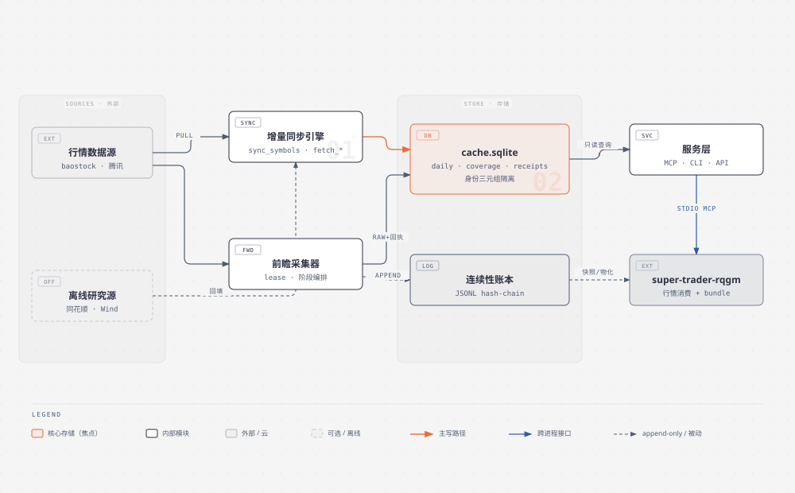
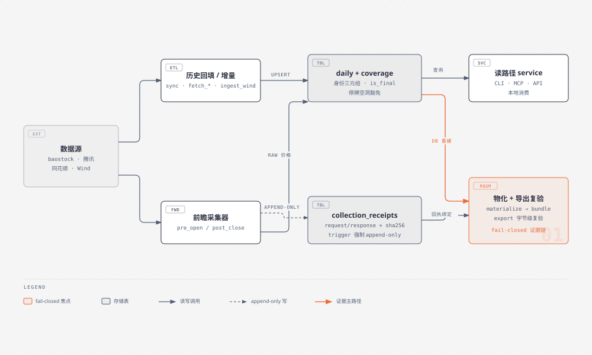
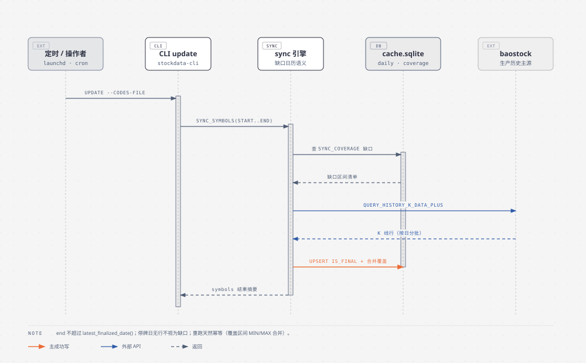
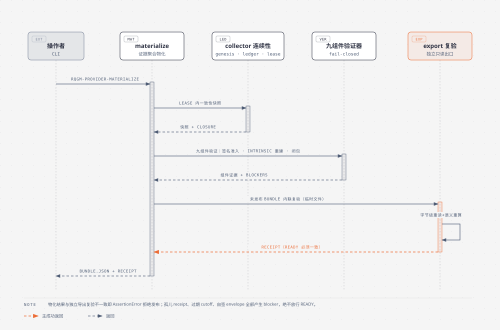
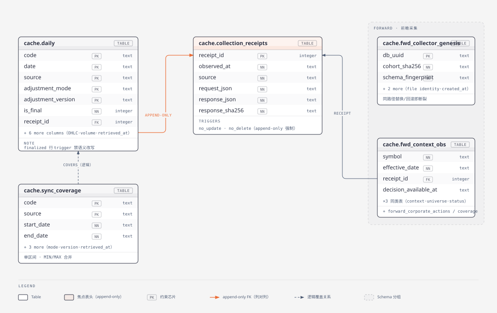

# 本地 A 股行情数据服务

*stock_data · Technical Manual · v2.0 · main@096e9ed*

SQLite 缓存的日线 OHLCV 服务，drop-in 替换 ffd.findesk.cn 的 FFD MCP 数据源；同时为 super-trader-rqgm 提供 fail-closed 的九组件 provider 证据链。

#### 项目定位
- 本地优先：先查缓存、仅拉缺口、断网离线可读
- 双角色：行情查询服务 + RQGM provider 证据生产
- 零外部服务依赖：单个 SQLite 文件即全部状态

#### 核心红线
- 复权身份三元组绝不混源（source·mode·version）
- provider readiness 全链路 fail-closed
- 回执 append-only，finalized 价格不可改写

#### 规模指标
- 115 个 Python 文件 · 49 个 stockdata 模块
- 60+ 测试文件 · 全量套件约 17 分钟
- 3 个价格身份 · 577 个去重代码 · 生产身份至 2026-08-28

## 整体架构

主流程自左向右：数据源 → 采集（增量同步 / 前瞻采集）→ 存储（SQLite + 连续性账本）→ 服务与消费。存储层是唯一的系统之心。

<p></p>

*存储层是唯一的写焦点：三条采集路径全部汇入 cache.sqlite，服务层只读。*

## 数据流向

两条写入路径（历史/增量同步、前瞻采集）与两条读取路径（本地查询服务、RQGM 物化导出）。所有写入按身份三元组隔离，混源在入库点即被拒绝。

<p></p>

*采集器既写 raw 价格行也写回执；物化端只从不可变快照与绑定回执重建证据，从不信任调用方 JSON。*

## 模块时序

### 日常增量同步

<p></p>

### provider 物化与独立导出复验

<p></p>

## 数据模型

全部状态驻留于 `~/.stockdata/cache.sqlite`（`STOCKDATA_DB` 可覆盖）与一个 JSONL 账本文件。行级价格身份由三元组 `(source, adjustment_mode, adjustment_version)` 决定，主键即含三元组——同一代码同一日期可安全并存多个来源的口径。下图为物理模型（列级），非概念 ER。

<p></p>

### 价格身份登记册（2026-08-31 实库口径）

| 身份 (source · mode · version) | 代码数 | 数据区间 | 角色 | 读写策略 |
| --- | --- | --- | --- | --- |
| `baostock · qfq · baostock-adjustflag-2` | 104 | 2015-01-05 → 2026-08-28 | 生产读取路径唯一身份 | 可读可写；`sync_symbols` 日更 |
| `tonghuashun · qfq · ths-qfq-v1` | 473 | 2023-05-29 → 2026-08-14 | 离线宇宙（研究级） | 只读冻结；不回补、不合并实时 bar |
| `wind · qfq · wind-fwd-v1` | 501 | 2023-12-01 → 2026-08-24 | 研究 / 跨源验证 | 只读；`ingest_wind_csv` 校验入库，缺 coverage 不自证 |
| `tencent · raw · tencent-qt-daily-v1` | 前瞻面板 | 注册日起前向 | 采集器 raw 价格 + 回执 | 仅注册采集器写；finalized 行 append-only |

缺口语义：相对已覆盖区间 `[min,max]` 的左右日历延伸段；停牌造成的中间空洞不视为缺口。跨身份重叠代码（28 个 wind/baostock）收盘价偏差中位数 0.0000%（2026-08-24 比对）。

## 启动指令

### 安装与自检

```bash
python3.12 -m venv .venv && .venv/bin/pip install -e '.[mcp,dev]'
.venv/bin/python verify_stockdata.py          # 端到端冒烟（读路径 + 缓存命中）
.venv/bin/python -m pytest -q                  # 全量套件（默认跳过 network 标记，约 17 分钟）
```

### MCP 行情服务（stdio，drop-in 替换 FFD）

```bash
stockdata                                     # = python -m stockdata.server
# 暴露工具：ffd_query / ffd_quote_history；super-trader-rqgm 将 FFD MCP 指向本进程即可
```

### CLI 读取

```bash
stockdata-cli history --code 600519.SH --start 2026-08-01 --end 2026-08-24
stockdata-cli quote_history --codes 600519.SH,000001.SZ --start 2026-08-01
stockdata-cli realtime --code 600519.SH       # 腾讯实时 bar（仅 baostock 身份合并）
```

### Python API

```python
from stockdata import make_service
svc = make_service()                          # 生产身份：baostock/qfq/baostock-adjustflag-2
rows = svc.get_history("600519.SH", "2026-08-01", "2026-08-24")
# 研究身份只读：make_service(source="wind", adjustment_version="wind-fwd-v1")
# 非 baostock 身份禁止 fetch_missing=True（混源逃生门已封，ValueError）
```

## 更新数据指令

### 日常增量（baostock 生产身份）

```bash
stockdata-cli update --codes-file config/panel-baostock.txt --start 2026-08-25
# end 缺省 = latest_finalized_date()；覆盖区间自动 MIN/MAX 合并，重跑幂等
```

### 历史回填

```bash
.venv/bin/python scripts/fetch_baostock_calendar.py          # 交易日历
.venv/bin/python scripts/fetch_baostock_index_universe.py    # 指数成分宇宙
.venv/bin/python scripts/fetch_baostock_corporate_actions.py # 公司行动
.venv/bin/python scripts/fetch_tencent_history.py            # 腾讯通道历史
```

### Wind 研究身份入库（限流敏感，单 worker 串行）

```bash
# 1) 经 MCP datasource wind_get_price 分批拉取 CSV（每批 ≤3 ticker，调用间隔 ≥12s，限流退避 60s）
# 2) 校验入库：停牌行(平推价+空量)跳过；跨文件冲突整日拒收；日历只取非 wind 来源
.venv/bin/python scripts/ingest_wind_csv.py /tmp/wind_fill   # 退出码 0 成功 / 1 脏数据 / 2 无独立日历
```

### 前瞻采集（注册面板，盘前/盘后两阶段）

```bash
stockdata-cli future-panel-prepare --database ~/.stockdata/cache.sqlite --panel-file panel.txt
stockdata-cli future-panel-register --output reg.json --database ~/.stockdata/cache.sqlite \
    --panel-file panel.txt --source-receipt r1.json --calendar-file cal.json \
    --calendar-authority cal.env.json --market-rules-file rules.json --market-rules-authority rules.env.json
stockdata-cli registered-panel-capture --registration-file reg.json \
    --database ~/.stockdata/cache.sqlite --date 2026-08-25 --phase post_close
```

### provider 物化与导出

```bash
stockdata-cli rqgm-provider-materialize --output-dir out/bundle --database ~/.stockdata/cache.sqlite \
    --registration-file reg.json --snapshot-staging-directory out/staging --panel-file panel.txt \
    --source-receipt r1.json [--source-receipt ...] --execution-adjustment-file ej.json \
    --signal-adjustment-file sj.json --component-file c1.json [...] \
    --component-authority a1.env.json [...] --source tencent
stockdata-cli rqgm-provider-export --bundle-file out/bundle/bundle.json   # 只读字节级复验
```

## 扫描方案（完整性审计）

| 扫描 | 工具 / 方法 | 判定标准 | 建议节奏 |
| --- | --- | --- | --- |
| 身份内空洞 | `scripts/audit_cache_completeness.py`：逐身份逐代码扫描 interior gap 与 tail lag | interior-gap = 0（停牌豁免）；tail-lag ≤ 1 个交易日 | 每日同步后 |
| 覆盖区间一致性 | SQL：`sync_coverage` 区间 vs `daily` 实际 min/max | 区间不超出实际数据；无重叠身份 | 每周 |
| 跨源偏差 | `scripts/compare_tencent_baostock.py` + 跨身份收盘价差分 | 重叠代码收盘偏差中位数 ≈ 0 | 每周 / 入库新源后 |
| 异常行 | SQL：负价格、非有限值、low>high、负成交量 | 0 行（入库点已校验，扫描兜底） | 每周 |
| 研究工件 | `scripts/verify_research_artifacts.py` · `validate_against_findesk.py` | 哈希与行数一致 | 变更后 |
| 证据链 | `rqgm-provider-export` 对存量 bundle 重跑字节级复验 | ready 判定与物化时一致 | 发布前必跑 |

2026-08-31 实库查询口径：baostock 身份 104 代码（2015-01-05 → 2026-08-28，无 tail lag；面板文件 config/panel-baostock.txt 与之对齐，launchd 日更）；wind 身份 501 代码（2023-12-01 → 2026-08-24，研究只读，待人工 ingest 追平）；tonghuashun 身份 473 代码（2023-05-29 → 2026-08-14，只读冻结，各代码深度不一）。全库 577 个去重代码，28 个 wind/baostock 重叠代码收盘价偏差中位数 0.0000%（2026-08-24 比对）。

## 自动化持续更新机制

launchd（macOS 原生）承载定时任务；所有任务共享三条守卫：只写各自身份、end 不超过最新 finalized 交易日、任何校验失败以非零退出并保留现场（不记 coverage）。

| 任务 | 调度 | 内容 | 状态 |
| --- | --- | --- | --- |
| `daily-sync` | 周一至周五 17:35 | `scripts/daily_sync.sh`：baostock 身份 104 代码 `update` 增量（start = 当日-30 天，end = 最新 finalized 日） | **已部署**（2026-08-26，8/27、8/28 两次实盘运行均 exit=0） |
| `wind-ingest` | 交易日 21:00 | 单 worker 串行拉前一日 wind 数据（501 代码 ≈ 35 分钟）→ `ingest_wind_csv` | 未部署，半自动人工触发 |
| `weekly-audit` | 周日 09:00 | `audit_cache_completeness` + 跨身份偏差比对 + 异常行扫描 | 未部署 |
| `monthly-backup` | 每月 1 日 06:00 | `scripts/backup_encrypt.py` 加密备份 SQLite + 账本 | 未部署（脚本需交互密码，暂不能无人值守） |

### daily-sync 部署明细（2026-08-26 起生效）

- plist：`~/Library/LaunchAgents/local.stockdata.daily-sync.plist`（已 `launchctl load`，`launchctl list | grep stockdata` 可见）
- 包装脚本：`scripts/daily_sync.sh`，负责：单实例锁（`~/.stockdata/daily-sync.lock`，防与手动同步撞车）、计算滚动 start、日志落盘、失败时 macOS 系统通知
- 日志：`~/.stockdata/logs/daily-sync.log`（同步输出）+ `daily-sync.launchd.log/.err`（launchd 本身）
- 非交易日空跑无害：baostock 无数据返回即零增量；漏跑由 30 天滚动窗口自动追平
- 卸载：`launchctl unload ~/Library/LaunchAgents/local.stockdata.daily-sync.plist`

- **幂等性是自动化前提**：覆盖区间 MIN/MAX 合并 + 30 天滚动窗口，使任何漏跑都能被后续运行自动追平，无需补偿逻辑。
- **Wind 通道保持半自动**：MCP datasource 有调用配额与限流，批量回填沿用"子代理串行 + 节奏守卫"模式，不并入无人值守任务。
- **codebase-memory 索引**：代码结构索引（`Users-cdzhangxueli-workspaces-stock_data`）在重大提交后手动重建；本说明书的架构/时序/物理模型图可由索引重新生成校准。
- **fail-closed 兜底**（2026-08-26 加固）：入库前 bar 级校验（价格为正且有限、OHLC 关系、volume 非负，脏行整批拒收）；baostock 空字段不再写成 0.0 假 bar；历史 no_data 区间不再扩展 coverage（假完整已封）；拉取失败抛 `HistoryFetchError` 向上传播；CLI 写入型命令 errors>0 时非零退出；非 collector 连接 busy_timeout=30s。

---

STOCK_DATA · TECHNICAL MANUAL · GENERATED 2026-08-25  
DIAGRAMS: diagram-design v2 EDITORIAL SYSTEM · SOURCE: codebase-memory-mcp INDEX + main@096e9ed

